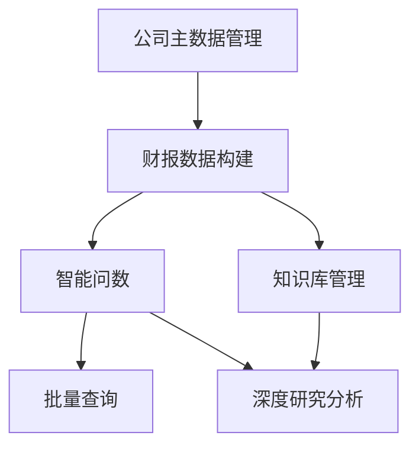
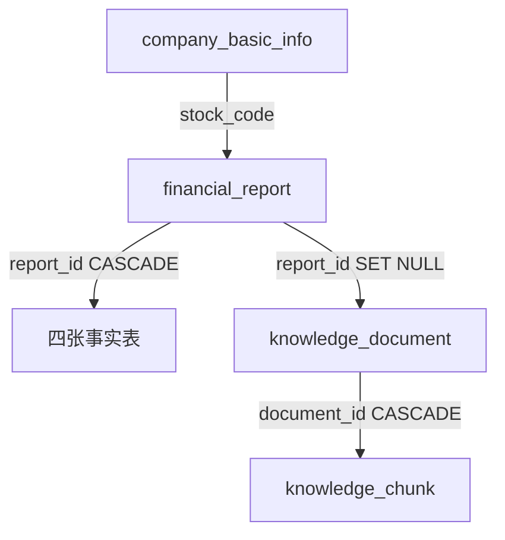

# 上市公司财报智能问数助手 — 模块说明文档

> 本文档说明系统的业务功能设计、模块边界和协作关系。
> `doc/项目结构文档.md` 负责说明代码组织，本文档负责说明业务模块如何支撑产品能力。
> 更新日期：2026-05-16

---

## 1. 文档定位

本文档面向开发人员，从**业务功能视角**描述系统的模块划分、核心能力和协作关系。阅读本文档可以理解"系统做什么、模块间怎么配合"。

与 `doc/项目结构文档.md` 的分工：项目结构文档说明代码目录和技术栈，本文档说明业务模块的设计意图和功能边界。

建议阅读顺序：先读项目结构文档建立代码组织认知，再读本文档理解业务逻辑。

---

## 2. 系统功能定位

本系统是一个**上市公司财报智能问数助手**，围绕财报数据从非结构化到结构化、从存储到查询、从简单到深入的完整链路设计。

系统围绕以下四个核心能力方向构建：

| 能力方向 | 业务目标 |
|---------|---------|
| 数据构建 | 将非结构化财报 PDF 转化为结构化财务数据并存入关系型数据库 |
| 智能查询 | 用户通过自然语言对话查询财务数据，系统自动生成 SQL 并返回结果 |
| 知识检索 | 将研报/财报原文向量化后支持语义检索，提供带证据的深度回答 |
| 批量查询 | 对预设查询条件批量执行智能数据查询并导出标准化结果 |

---

## 3. 端侧职责划分

| 端侧 | 职责定位 | 设计关注点 |
|------|---------|-----------|
| 前端界面（Vue 3） | 用户交互入口，提供数据上传、对话问答、工作台管理等页面 | 页面自含状态管理，组件按业务域组织，统一错误与加载状态处理 |
| 后端服务（FastAPI） | 业务逻辑核心，编排数据处理、AI 调用、数据库读写等全流程 | 分层架构（API → Services → Models），同步/异步分离，函数式 Service |
| 关系型数据库（MySQL） | 存储结构化业务数据，包括财报、对话、题目、知识库元数据 | 星型模型设计，级联删除策略，独立后台会话避免事务冲突 |
| 向量数据库（Milvus） | 存储文档切块的向量嵌入，支持语义相似度检索 | IVF_FLAT 索引 + COSINE 度量，支持按股票代码和文档类型过滤 |
| AI 服务（LLM / Embedding） | 提供意图识别、SQL 生成、结构化抽取、答案生成、文本向量化能力 | 统一模型工厂管理，Prompt 外置于 YAML 配置 |

---

## 4. 功能模块总览

| 模块 | 定位 | 核心产出 |
|------|------|---------|
| 公司主数据管理 | 管理上市公司基础信息，作为财报身份匹配的主数据源 | 公司基础信息记录 |
| 财报数据构建 | 从 PDF 中自动提取结构化财务数据并入库 | 四张财务事实表数据 |
| 智能问数 | 自然语言驱动的财务数据查询对话 | SQL 查询结果 + 分析结论 + 可视化图表 |
| 批量查询 | 对预设查询条件批量调用智能问数能力并导出标准化结果 | 标准化的批量查询结果 |
| 知识库管理 | 管理研报/财报文档的切块、向量化和语义检索 | 向量化知识库索引 |
| 深度研究分析 | 结合知识库检索和结构化查询的规划式多步推理问答 | 带证据引用的深度分析报告 |

---

## 5. 各业务模块说明

### 5.1 公司主数据管理

**定位**：系统数据流水线的起点，为财报身份解析提供公司匹配依据。

**核心功能**：
- 从 Excel 导入上市公司基础信息（股票代码、简称、行业分类等）
- 支持增量导入，已存在的记录自动更新
- 为财报上传时的身份匹配提供唯一键（股票代码）

**设计边界**：
- 仅负责公司基础信息的导入和存储，不包含公司数据的编辑、删除功能
- 财报身份解析时作为只读主数据源被引用，不反向依赖财报模块

**关联模块**：财报数据构建（身份匹配依赖此模块的公司数据）

**开发关注点**：
- 股票代码（6位）是全局唯一标识，被财报主表和知识库文档引用
- 必须在财报上传之前完成公司数据导入，否则建档阶段会因匹配失败而拒绝

### 5.2 财报数据构建

**定位**：将非结构化财报 PDF 转化为结构化财务数据的核心数据管道。

**核心功能**：
- PDF 文件上传与本地存储，支持单文件和批量上传
- 从 PDF 文件名和内容中解析财报身份信息（股票代码、年份、报告期、报告类型）
- 调用 LLM 从 PDF 中智能抽取四张财务报表数据（资产负债表、利润表、现金流量表、核心业绩指标表）
- 对抽取结果进行四层校验（结构校验 → 字段校验 → 类型校验 → 业务校验）
- 校验通过后 UPSERT 写入事实表，删除主表时级联删除事实表

**设计边界**：
- 不处理非财报类的 PDF 文档（研报等由知识库模块负责）
- 同步完成建档和身份解析（秒级响应），结构化抽取放入后台线程异步执行
- 身份字段由主表统一回填，不让 LLM 输出身份字段以防出错

**关联模块**：公司主数据管理（身份匹配）、智能问数（数据消费方）、知识库管理（财报原文向量化）

**开发关注点**：
- 五段处理流程（建档 → 身份解析 → 结构化抽取 → 校验 → 入库）每段独立记录校验日志
- 单份财报四张表并行抽取，多份财报最多 3 并发，通过 Semaphore 控制连接数
- LLM 调用使用智能上下文窗口（锚点定位 + 有限页数），短 PDF（≤10 页）传全文
- 金额统一为万元单位，数值类型使用 Decimal，空值统一为 None

### 5.3 智能问数

**定位**：自然语言到结构化财务数据查询的对话引擎。

**核心功能**：
- 自然语言意图解析，提取公司、指标、时间范围三个核心槽位
- 多轮对话上下文继承，支持指代消解（"它"、"该公司"、"其中"等）
- SQL 自动生成，优先使用确定性模板，回退到 LLM 生成
- 支持 9 种派生指标计算（同比、环比、复合增长率、占比、行业均值等）
- 意图澄清机制，缺失关键信息时主动追问而非盲目回答
- 不支持查询的指标主动告知用户并建议替代方案
- 查询结果自动生成可视化图表（9 种图表类型）

**设计边界**：
- 仅查询结构化财务数据，不涉及知识库语义检索
- SQL 安全校验四层机制：禁止关键字 → 必须 SELECT → 表名白名单 → 自动 LIMIT
- 不做数据写入，所有查询均为只读操作

**关联模块**：财报数据构建（数据源）、批量查询（复用对话能力）

**开发关注点**：
- 对话处理包含 13 个阶段，核心链路为：指代消解 → 意图识别 → 槽位检查 → SQL 生成 → 安全校验 → 执行 → 图表 → 回答
- 查询类型分 5 种：单值、趋势、排名、对比、连续性，每种有不同必需槽位
- 派生指标 SQL 优先使用窗口函数模板（如同比用 LAG），模板失败时回退到 LLM 生成
- SQL 执行后做万元单位归一化，检测疑似元/万元混用的异常大值自动修正

### 5.4 批量查询

**定位**：将预设查询条件批量提交至智能问数引擎的自动化执行工作台。

**核心功能**：
- 从 Excel 导入查询条件列表并初始化工作台
- 单条/批量/全量自动查询，每条查询复用智能问数的完整处理链路
- 多条件查询按顺序依次执行，共享同一会话上下文
- 查询结果的删除、重新执行，级联清理关联会话和图表文件
- 结果导出为标准化 Excel 和 JSON

**设计边界**：
- 不实现独立的查询逻辑，本质是对智能问数服务的包装编排
- 查询条件从 Excel 读取后直接送入对话引擎

**关联模块**：智能问数（核心依赖，复用 process_chat_message）

**开发关注点**：
- 批量执行使用线程池（max_workers=3），每个线程独立数据库会话
- 删除查询结果时需级联清理关联的 chat_session 和图表文件
- 导出时读取数据库中已缓存的答案，不会重新执行

### 5.5 知识库管理

**定位**：管理非结构化研报/财报文档的向量化索引，为语义检索提供数据基础。

**核心功能**：
- 系统初始化：从 Excel 加载文档元数据（标题、类型、股票代码）
- 增量 PDF 上传：按文件名匹配元数据，提取文本后按页切块
- 文本切块：按固定大小（1600 字符）和重叠度（160 字符）分页切块
- 向量化：通过 Embedding API 将切块文本转为向量写入 Milvus
- 语义检索：查询文本 → 向量化 → Milvus 相似度搜索 → 返回证据片段
- 三级状态管理（元数据状态 → 切块状态 → 向量化状态），支持失败重试

**设计边界**：
- 只管理文档和向量，不直接参与对话或 SQL 查询
- 文件名匹配为精确匹配（去除 .pdf 后缀），匹配失败则拒绝上传
- 检索时支持按股票代码和文档类型过滤，结果为空时自动放宽条件

**关联模块**：深度研究（知识库检索的消费方）、财报数据构建（财报原文来源）

**开发关注点**：
- 增量构建模式而非一次性批量，单文档失败不影响其他文档
- 切块使用 SHA256 哈希去重，避免重复向量化
- 向量检索采用宽松回退策略：依次放宽 stock_code → 放宽 doc_type 过滤

### 5.6 深度研究分析

**定位**：结合知识库检索和结构化查询的规划式多步推理问答引擎。

**核心功能**：
- 问题分析与执行规划：LLM 分析问题后拆解为多步骤执行计划
- 6 种步骤类型：SQL 查询、派生指标计算、知识库检索、聚合统计、结果校验、答案组装
- 按步骤间依赖关系顺序执行，无依赖步骤可并行
- 程序化派生指标计算（资产负债率、毛利率等），确保数值精度
- 四层结果校验：完整性 → 一致性 → 合理性 → 引用有效性
- 深度分析工作台：导入分析主题、单条/批量执行、删除、重新执行
- 导出时重新执行每个分析任务（非读缓存），确保结果反映最新数据状态

**设计边界**：
- 不直接用 LLM 回答问题，而是先生成执行计划再逐步执行
- 程序化计算替代 LLM 推导，复合指标由公式计算确保精度
- 复用智能问数的 SQL 生成和安全校验能力，不重复实现

**开发关注点**：
- 规划分四种模式：简单查询、知识库检索、混合型、LLM 生成计划
- 执行器内置规则化 SQL 模板覆盖高频场景，失败时回退到 LLM 生成
- 派生指标使用 Decimal 保证精度，支持公式计算和同比增长
- 导出行为特殊：重新执行完整流程而非读取缓存答案

**关联模块**：智能问数（复用 SQL 能力）、知识库管理（语义检索）、财报数据构建（数据源）

**开发关注点**：
- 规划分四种模式：简单查询、知识库检索、混合型、LLM 生成计划
- 执行器内置规则化 SQL 模板覆盖高频场景，失败时回退到 LLM 生成
- 派生指标使用 Decimal 保证精度，支持公式计算和同比增长
- 导出行为特殊：重新执行完整流程而非读取缓存答案

---

## 6. 通用支撑能力

### 6.1 统一响应与异常处理

- 所有接口返回统一格式 `{code, message, data}`，通过 `success()` / `error()` 构造
- 错误码使用 `ErrorCode` 枚举（参数错误 1xxx、认证错误 2xxx、文件错误 3xxx、AI 错误 4xxx、内部错误 5xxx）
- 业务异常通过 `ServiceException` 抛出，API 层统一捕获处理
- 分页响应使用 `PaginatedResponse`，包含 lists + 分页元信息

**开发时应避免**：硬编码错误码、在 API 层直接处理业务逻辑异常、跳过统一响应格式。

### 6.2 AI 调用支撑

- 模型工厂（`ModelFactory`）统一管理 Chat 和 Embedding 模型客户端，通过 `@lru_cache` 单例化
- Chat 模型使用 LangChain 的 `ChatOpenAI` 接口，支持自定义 temperature 和 max_tokens
- Embedding 模型使用 DashScope 的 `text-embedding-v2`，维度 1024
- Prompt 模板外置于 YAML 配置文件，按业务场景独立管理

**开发时应避免**：直接实例化模型客户端、在代码中硬编码 Prompt 文本、绕过模型工厂创建新连接。

### 6.3 数据库与 ORM

- SQLAlchemy 统一管理引擎和会话工厂，通过依赖注入提供请求级会话
- 后台异步任务使用独立数据库会话（`get_background_db_session`），避免与请求级会话事务冲突
- 事务由 Service 层负责 commit/rollback，API 层不参与事务管理

**开发时应避免**：在 API 层操作数据库会话、后台任务复用请求级会话、跨会话传递 ORM 对象。

### 6.4 校验日志

- 为财报处理的每个阶段（建档、身份解析、抽取、校验、入库）创建独立校验日志
- 记录处理结果（通过/失败）、错误详情和上下文信息
- `is_blocking` 字段标记是否阻断主流程

**开发时应避免**：跳过校验日志记录、在非财报处理流程中使用校验日志。

### 6.5 文件与日志

- 文件保存工具自动创建父目录，JSON 保存使用 UTF-8 编码
- 日志格式统一：`[时间] [文件名:行号] [日志名] [级别] 消息`，使用 f-string
- 上传文件以 UUID 重命名保存到配置目录

**开发时应避免**：使用 `%s` 格式化日志、手动拼接文件路径、硬编码上传目录。

---

## 7. 模块间关键关系

### 7.1 数据构建链路

公司主数据是财报建档的前置依赖，PDF 经过五段处理流程后入库为结构化数据。

### 7.2 智能查询链路

智能问数的 13 阶段处理链路，槽位缺失时走澄清分支，完整时走查询分支。

### 7.3 模块依赖总览

箭头表示"被依赖方 → 依赖方"。智能问数和知识库管理是两个核心能力节点，分别被批量查询和深度研究分析消费。

### 7.4 用户数据边界

主表与事实表为一对一关系（report_id 既是主键又是外键），删除主表时级联删除事实表。知识库文档与财报为弱关联（SET NULL）。

---

## 8. 典型业务闭环

### 闭环一：构建财报数据库

1. 在公司信息导入页上传 Excel，导入上市公司基础信息
2. 在财报列表页上传 PDF 文件，系统自动完成建档和身份解析
3. 点击"解析"提交结构化抽取任务，系统后台异步执行
4. 轮询解析状态，等待抽取、校验、入库全部完成
5. 在财报详情页查看四张财务报表的结构化数据

### 闭环二：自然语言查询财务数据

1. 在智能问数页面新建对话或切换已有会话
2. 输入自然语言问题（如"金花股份2025年Q3净利润是多少"）
3. 系统自动识别公司、指标、时间范围，生成 SQL 查询
4. 如缺少关键信息，系统主动追问补充
5. 展示查询结果、SQL 语句和可视化图表
6. 可继续追问，系统自动继承上下文

### 闭环三：构建知识库并开展深度研究分析

1. 在知识库管理页进行系统初始化（上传 Excel 加载元数据）
2. 增量上传研报 PDF，系统自动切块和向量化
3. 在深度研究工作台导入分析主题
4. 系统对每个主题生成执行计划（SQL 查询 + 知识库检索 + 派生计算）
5. 按步骤执行并校验，生成带证据引用的深度分析报告
6. 导出标准化分析结果

### 闭环四：批量查询并导出结果

1. 在批量查询工作台导入查询条件列表
2. 执行单条或批量查询，系统逐条调用智能问数引擎
3. 查看每条查询的结果详情（Markdown 结果、SQL、图表）
4. 对失败或不满意的查询重新执行
5. 一键导出标准化批量查询结果

---

## 9. 后续开发参考原则

1. **新业务功能优先复用现有 Service 能力**：智能问数的 SQL 生成和安全校验已被批量查询和深度研究分析复用，新增查询场景应优先走模板路径而非独立实现
2. **LLM 调用必须通过模型工厂**：禁止直接实例化模型客户端，确保连接复用和配置统一
3. **结构化数据相关逻辑放在 Service 层**：API 层只做参数校验和响应构造，不包含业务判断
4. **异步任务必须使用独立数据库会话**：后台线程池中的任务使用 `get_background_db_session`，禁止复用请求级会话
5. **Prompt 修改走 YAML 配置文件**：所有提示词模板外置，不在代码中硬编码
6. **事实表操作以 report_id 为锚点**：四张事实表的主键即外键，操作时始终通过 report_id 关联主表
7. **派生指标计算使用 Decimal 而非 float**：财务数据精度要求高，避免浮点误差
8. **新增 SQL 查询场景优先编写模板**：模板保证确定性和安全性，LLM 生成仅作为 fallback
9. **删除操作注意级联范围**：删除财报主表会级联删除四张事实表，删除知识库文档会级联删除所有切块
10. **导出功能要区分"读缓存"和"重新执行"**：批量查询导出读已有答案，深度研究分析导出重新执行完整流程，行为不同不可混淆
